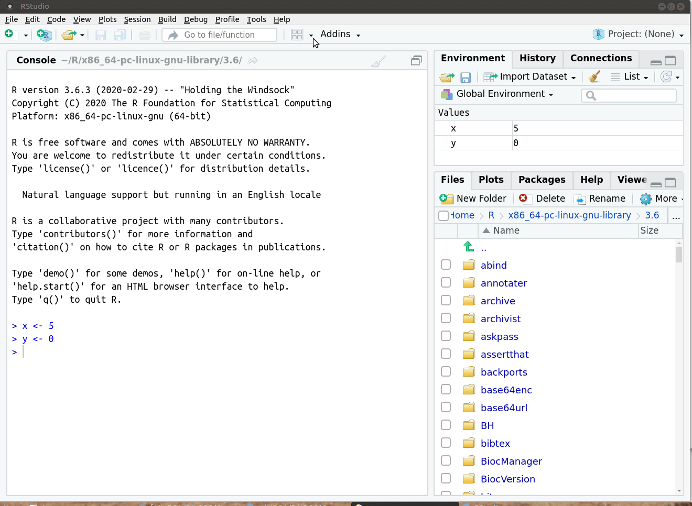

```{r, include = F}
knitr::opts_chunk$set(fig.width = 6, message = FALSE, warning = FALSE, comment = "", cache = FALSE, fig.retina = 3)
library(flipbookr)
library(dplyr)
library(flair)
library(kableExtra)
```
```{r xaringan-themer, include=FALSE, warning=FALSE}
library(xaringanthemer)
style_duo_accent(
  #base_color = "#43a2ca",
  header_font_google = google_font("Mukta"),#Ubuntu Condensed
  text_font_google   = google_font("Montserrat", "300", "300i"),
  code_font_google   = google_font("Fira Mono"),
  primary_color      = "#0F4C81", # pantone classic blue
  secondary_color    = "#b3e2cd", # pantone baby blue
  #header_font_google = google_font("Raleway"),
  #text_font_google   = google_font("Raleway", "300", "300i"),
  #code_font_google   = google_font("Source Code Pro"),
  text_font_size     = "25px"
#   colors = c(
#   red = "#f34213",
#   purple = "#3e2f5b",
#   orange = "#ff8811",
#   green = "#136f63",
#   white = "#FFFFFF",
# )
)

```

```{r, include=FALSE}
text_spec2 <- function(x = "x"){
  text_spec(x, background = "#b3e2cd", bold = T)
}

text_spec3 <- function(x = "x"){
  kableExtra::text_spec(x, color = "deeppink", bold = T)
}

text_spec4 <- function(x = "x"){
  kableExtra::text_spec(x, color = "#fd8d3c", bold = T)
}

text_spec5 <- function(x = "x"){
  kableExtra::text_spec(x, color = "#08519c", bold = T)
}

```


```{r xaringanExtra, echo=FALSE}
xaringanExtra::use_xaringan_extra(c("tile_view", "animate_css", "tachyons"))
xaringanExtra::use_freezeframe()
xaringanExtra::use_clipboard()
xaringanExtra::use_editable(expires = 1)
```


```{css, echo=F}
.code-bg-palegreen .remark-code, .code-bg-palegreen .remark-code * {
 background-color:palegreen!important;
}

.code-bg-skyblue .remark-code, .code-bg-skyblue .remark-code * {
 background-color:skyblue!important;
}
```

# ¿Qué haremos hoy?

- Estructuras de control

  - Condicionales: if-else
  
  - Iterativas: for, repeat, while, break, next

- Vectorización

- Buenas prácticas al escribir código en R

---
# Estructuras de control 


- Permiten `r text_spec2("controlar el flujo de ejecución")` de una serie de expresiones de R.
<br><br>
--


- En general se usan dentro de funciones o cuando se escriben expresiones "largas".
<br><br>
--

- Las estructuras de control se clasifican en `r text_spec2("condicionales")` e `r text_spec2("iterativas")`.
<br><br>
--

- Todas son `r text_spec2("palabras reservadas")` que no se pueden usar para denominar obejtos ni funciones (if, while, for, break, next, repeat).

---
# Estructuras de control

- `r text_spec2("if")`, `r text_spec2("else")`: testean una condición y actúan en consecuencia
<br><br>
--

- `r text_spec2("for")`: ejecuta un loop (bucle) un número fijo de veces
<br><br>
--

- `r text_spec2("while")`: ejecuta un loop mientras una condición se cumple (es true)
<br><br>
--

- `r text_spec2("repeat")`: ejecuta un loop infinitamente a menos que se explicite un break
<br><br>
--

- `r text_spec2("break")`: corta la ejecución de un loop
<br><br>
--

- `r text_spec2("next")`: salta una iteración de un loop
<br><br>
--

- Para pedir la ayuda de if debo hacer `help("if")`

---
# if - else


La estructura if-else permite `r text_spec2("testear una condición")` y ejecuta un código si se cumple (es true) y otro si no se cumple (es false).
--

```{r eval=FALSE}
if (<condicion>) {
  # hace algo
} else {
  # hace otra cosa
}
```
--

La forma más básica es usar solo if.
--


```{r eval=FALSE}
if (<condicion>) {
  # hace algo
} 
```

Si la condición no se cumple (es FALSE), el código no hace nada. 
<br><br>
--

Cuando se escribe la condición y la orden  en la misma línea no es necesario usar llaves pero es una buena práctica usarlas.


---
# Ejemplo if-else

- Sorteo un número del 1 al 45 con la función `r text_spec2("sample()")` y lo guardo en el objeto x.
<br><br>
--

- Evalúo si x es mayor a 10 y le asigno al objeto z el valor 1, de lo contrario le asigno el valor 0.
--

```{r}
x <- sample(x = 1:50, size = 1)

if (x > 10) {
      z <- 1
} else {
      z <- 0
}
```
--

El valor de z depende de si x es mayor a 10 o no. 

```{r}
z
```

---
# Ejemplo

- Exporto un objeto a formato RData si existe en mi espacio de trabajo
<br><br>
--

- Dentro de la función `r text_spec2("exists()")` hay que definir el nombre del objeto entre comillas.
<br><br>
--

- De esta manera evito que me devuelva un error cuando no existe
<br><br>
--

```{r eval = FALSE}
if (exists("atletas")) {
 save(atletas, file = "atletas.RData")
}

if (exists("naciones")) {
 save(naciones, file = "naciones.RData")
}

```


---
# if vectorizado 

- La instrucción if acepta en la `r text_spec2("condición lógica un único valor lógico")`.

- Si pasamos un vector lógico con una longitud mayor que uno, R nos dará un `r text_spec2("warning")` (advertencia) indicándonos que hemos introducido múltiples opciones, pero que únicamente la primera será utilizada:

```{r eval = FALSE}
# sorteo 5 números
x <- sample(1:45, size = 5)

if (x > 10) {
      z <- 1
} else {
      z <- 0
}
```

--

- R nos proporciona la función ifelse() para este cometido.
```{r}
z <- ifelse(x > 10, 1, 0)
```

---
# if - else if - else

Si se quieren testear una `r text_spec2("serie de condiciones")` se deben agregar else if intermedios entre if y else, tantos como condiciones adicionales.

```{r eval = FALSE}
if (<condicion1>) {
        # hacer algo
} else if (<condicion2>)  {
        # hacer otra cosa
} else {
        # hacer otra cosa diferente
}
```


---
# Ejercicio 

- Crea un vector que se llame cap y tome el valor 2, otro vector que se llame cnf y tome el valor 1.

- Crea una estructura if-else if- else que:
  - si cap > cnf imprima el mensaje "ganó Peñarol"
  - si cap < cnf imprima el mensaje "ganó Nacional"
  - en caso contrario imprima "empate"
  

---
# Estructuras de control iterativas

.left-column[
<br><br><br>

```{r echo = FALSE, out.width="10%", fig.align="center"}
knitr::include_graphics("https://media.giphy.com/media/t6lGyf3dk9qBEXhTj8/giphy.gif")
```
]

.right-column[

- Las `r text_spec2("instrucciones de repetición")`, de iteración o bucles, facilitan la repetición de un bloque de instrucciones, `r text_spec2("un número determinado de veces")` o `r text_spec2("mientras se cumpla una condición")`.

- Por lo general, existen dos tipos de estructuras iterativas o bucles en los lenguajes de programación.

  - `r text_spec2("for")`: un tipo de bucle que se ejecuta un número preestablecido de veces, que es controlado por un contador o índice, incrementado en cada iteración.
  - `r text_spec2("while")`, `r text_spec2("repeat")`: un tipo de bucle que se ejecuta mientras se cumple una condición. Esta condición se comprueba al principio (while) o el final de la construcción (repeat). 
]

---
# for 

- El bucle for es una estructura iterativa que `r text_spec2("se ejecuta un número preestablecido de veces")`
<br><br>
--

- Este número `r text_spec2("es controlado por un contador o índice")`, que se incrementa en cada iteración y asignando sucesivos valores a un objeto (vector, lista, etc).
<br><br>
--

- En caso de necesitar hacer un loop en R lo más común es que necesiten un for. 
<br><br>
--

- Tiene un código similar a la estructura if

```{r eval = FALSE}
for (i in 1:5) {
   print(i)
}

```
<br><br>
--

El contador i toma en cada iteración los valores 1, 2, 3, 4, 5 respectivamente y ejecuta el código dentro de las llaves. 

---
# Ejercicio 

- Crea un vector llamado num que contenga los números enteros del 10 al 19

- Crea un for que a cada uno de esos elementos le aplica la raíz cuadrada y se imprima el resultado

- ¿Te parece necesario este for o se puede resolver más simple?

---
# Ejemplo

- Si en vez de imprimir el resultado del for quiero guardarlo en un objeto debo crear antes ese objeto

```{r}
num <- 10:19

res <- numeric(length = length(num))

for (i in seq_along(num)) {
  res[i] <- sqrt(num[i])
}

res
```
--

- Esto lo podía resolver más fácil haciendo: 
```{r}
res <- sqrt(num)
res
```

---
# Ejemplo de for

- Tengo 4 archivos en formato RDS para cargar.

```{r echo = FALSE}
data_path <- here::here("2021", "Slides","data", "olympic_games")
files <- list.files(path = data_path,
                    pattern = "*.RDS",
                    full.names = TRUE)                                                 
```
```{r eval = FALSE}
data_path <- here::here("data")

files <- list.files(path = data_path, 
                    pattern = "*.RDS",
                    full.names = TRUE)                                                  
```

--
- Ahora, escribimos un for que debe contener una asignación a los nombres de los objetos que cargo con readRDS()

```{r eval = FALSE}
for (i in 1:length(files)) {                              
  assign(paste0("sport", i), 
         readRDS(files[i]))
}
```

---
# Vectorización

- Una diferencia clave entre R y muchos otros lenguajes es un tema conocido como vectorización. 
<br><br>
--

- Estos ejemplos de loop for que vimos no tienen sentido en R porque hay formas más simples de programar esa tarea.
<br><br>
--

- Las funciones en general tienen incorporada la vectorización. 
<br><br>
--

- Incluso en este último ejemplo con la función lapply() de R base. 
<br><br>
--

- Más adelante veremos una solución con el paquete purrr del ecosistema tidyverse que viene a sustituir a las funciones *apply().


---
# ¿Son lentos los loops en R?

- Sí, si los usamos en situaciones que podríamos aprovecharnos de la vectorización
<br><br>
--

- No hagas crecer los objetos (a través de c(), cbind(), etc) durante el loop, esto enlentece el for.
<br><br>
--

- Asigna un objeto para mantener los resultados y rellenalo durante el bucle
<br><br>
--

- Siempre que sea posible, utiliza operaciones vectoriales en lugar de bucles for.
<br><br>
--

- Si tu solución a un problema en R es un for, probablemente no sea la mejor solución.


---
# Ejemplo: guardar varios archivos a la vez

- Defino un vector con los nombres de los data frames
<br><br>
--

- Dentro del bucle for, especifico los nombres de nuestros df dentro de la función get() y la ruta del directorio:
<br><br>
--

```{r eval = FALSE}
library(readr)
# nombres de los data frame
data_names <- c("sport1", "sport2", "sport3", "sport4")                    

# pruebo que puedo guardar un archivo
write_csv(get(data_names[1]),
          here::here(data_path, "sport1.csv"))              


```
--
- Ahora lo generalizo con un bucle for

```{r eval = FALSE}
for (i in 1:length(data_names)) {     
  write_csv(get(data_names[i]),
            here::here(data_path, paste0("sport", i, ".csv"))
            )              
}
```

---
# while

- Los bucles while comienzan comprobando una condición. 
<br><br>
--

- Si esta es verdadera, entonces se entra al cuerpo del bucle. 
<br><br>
--

- Una vez completada una ejecución de este bloque, se comprueba la condición nuevamente y así sucesivamente hasta que la comprobación de la condición no se cumple.
<br><br>
--

```{r eval = FALSE}
while (<condicion>) {
  # código
}
```
--

- Hay que tener cuidado en poner una condición que nunca se cumpla porque en este caso el while no se detendrá. 

---
# Ejemplo

- Defino un objeto llamado count que tiene un valor inicial 0.

```{r}
count <- 0
```

- Armo la estructura while que evaluará la condición que count sea menor a 10.
--

- Mientras la condición se cumpla, le adicionará 1 al objeto count, cuando deje de cumplirse la condición, se detiene.

```{r}
while (count < 10) {
  print(count)
  count <- count + 1
}

```
---
# repeat

- La estructura repeat ejecuta un bucle infinitamente. 
--

- La única forma de terminar con el bucle es llamando dentro de este a la función break.

- break nos permite interrumpir un bucle, mientras que next nos deja avanzar a la siguiente iteración del bucle, saltándose la actual. 

```{r eval = FALSE}
repeat {
  # código
  # break para detenerlo
}
```

---
# Ejemplo

- Generamos el objeto count que toma el valor 0.
--
- Vamos a adicionar 1 a count hasta que count tome el valor 10, en ese caso se corta el bucle.

```{r eval = FALSE}
count <- 0

repeat {
  print(count)
  count <- count + 1
  if (count == 10) {
    break
  } 
}

```
---
# next

- Hacemos un bucle for y salteamos una iteración cuando se cumple una condición usando next 

```{r eval = FALSE}

for (i in 1:4) {
  if (i == 3) {
    next
  }
  print(i)
}
```


---
# Buenas prácticas al escribir código R

- Usa un estilo coherente dentro de tu código.
<br><br>
--

- La coherencia hace que el código sea más fácil de leer y los problemas más fáciles de detectar.
<br><br>
--

- Mantener en lo posible los scripts, datos, salidas en un mismo directorio.
<br><br>
--

- Usa rutas relativas para acceder a esos archivos.
<br><br>
--

-  Usa Rproj y el paquete here
<br><br>
--

- Usa control de versiones aunque trabajes de forma individual.
<br><br>
--

- No guardes el espacio de trabajo (workspace), esto puede generar resultados inesperados. Empieza en un entorno limpio cada vez.
<br><br>
--

- Evita el hard-coding!

---
# ~~Save workspace~~


```{r out.width="30%", fig.align= "center", echo = FALSE}

```
 
    
<!-- Todo esto nos lleva a escribir funciones para hacer nuestro código más legible y modular. -->


---
# Nombres

- Es preferible que los nombres de los objetos, archivos y funciones propias sean en minúscula. 
- Si tienen más de un término que estén separados por guión bajo (_) 
- Uno de los creadores de Tidyverse, Hadley Wickham recomienda usar sustantivos para los nombres de los objetos y verbos para las funciones
- Elegir nombres concisos y descriptivos para los objetos y las funciones.
- No utilizar tildes y eñes en los nombres de los objetos ni las funciones.
- Los scripts de R deben terminar con la extensión .R
- Evita usar nombres de funciones comunes, palabras reservadas o valores predeterminados de R para nombrar a tus objetos o funciones

.pull-left[
.code-bg-palegreen[
```{r eval = FALSE}
# +1
dia_uno
dia_1

```
]
]

.pull-right[
.code-bg-skyblue[
```{r eval = FALSE}
# -1
DiaUno
diauno
día_uno

T <- FALSE
c <- 10
mean <- function(x) sum(x)
```
]

]


---
# Uso de los espacios

Antes y después de la mayoría de los operadores hay que dejar un espacio. 

.pull-left[
.code-bg-palegreen[
```{r eval = FALSE}
# +1
x <- sqrt(2 + 4 -1)

```
]
]

.pull-left[
.code-bg-skyblue[
```{r eval = FALSE}
# -1
x <- sqrt(2+4-1)

```
]
]
<br><br><br>
--

Las excepciones a esta regla son cuando usamos `:`, `::`, `$`, `^`, etc. 

.pull-left[
.code-bg-palegreen[
```{r eval = FALSE}
# +1
vector <- 1:10
dplyr::select(1)
x <- sqrt(y^2 + z^4)
df$x

```
]
]

.pull-left[
.code-bg-skyblue[
```{r eval = FALSE}
# -1
vector <- 1 : 10
dplyr :: select(1)
x <- sqrt(y ^ 2 + z ^ 4)
df $x
```
]
]
--

---
# Uso de los espacios

No hay que dejar espacios antes de una coma, pero sí después.

.pull-left[
.code-bg-palegreen[
```{r eval = FALSE}
# +1 
v <- c(1, 2, 3)
x[, 1]
```
]
]

.pull-left[
.code-bg-skyblue[
```{r eval = FALSE}
# -1
v <- c(1,2,3)
x[ ,1]
x[,1]
x[ , 1]
```
]
]

--

Antes del paréntesis izquierdo va un espacio, a no ser que estemos llamando a una función.
Dejar un espacio antes y después de () cuando se utiliza if, for o while

.pull-left[
.code-bg-palegreen[
```{r eval = FALSE}
# +1
if (x > 2) {
  print(x)
}


mean(1:10)
```
]
]

.pull-left[
.code-bg-skyblue[
```{r eval = FALSE}
# -1
if(x>2){
  print(x)
}

mean (1:10)
mean( 1:10)
```
]
]

---
# Uso de espacios (función propia)

Agrega un espacio después de ()


.pull-left[
.code-bg-palegreen[
```{r eval = FALSE}
# +1
function(x) {}
```
]
]

.pull-left[
.code-bg-skyblue[
```{r eval = FALSE}
# -1
function (x) {}
function(x){}
```
]
]

---
# Uso del punto y coma

- Se recomienda no usar punto y coma para escribir en la misma línea dos o más expresiones

.pull-left[
.code-bg-palegreen[
```{r eval = FALSE}
# +1
x <- 1
y <- 2
z <- 3
```
]
]

.pull-left[
.code-bg-skyblue[
```{r eval = FALSE}
# -1
x <- 1; y <- 2; z <- 3

```
]
]


---
# Uso de llaves

- Al abrir una llave, el bloque de código debe agregarse en una siguiente línea 
- El bloque de código al interior de las llaves debe estar alineado a dos espacios
- La llave que cierra siempre tiene que ir su propia línea, a menos que se trate de else. 
- En general, usaremos llaves aunque el cuerpo de la estructura de control contenga sólo una instrucción.

Dentro de las llaves utilizaremos sangrado para indicar que se trata de un bloque de instrucciones.

.pull-left[
.code-bg-palegreen[
```{r eval = FALSE}
# +1
if (x < 2) {
  "mayor"
} else {
  "menor"
}

if (x == 0) {
  "cero"
}

```
]
]

.pull-left[
.code-bg-skyblue[
```{r eval = FALSE}
# -1 
if (1 < 2) 
{
"mayor"
} 
else {
"menor"
}

if (x == 0) 
"cero"

```
]
]

---
# Asignación

En la instrucción de asignación se aconseja el uso del operador <- en lugar de =, reservando este último para declarar argumentos dentro de las funciones.

.pull-left[
.code-bg-palegreen[
```{r eval = FALSE}
# +1
x <- 2

```
]
]

.pull-left[
.code-bg-skyblue[
```{r eval = FALSE}
# -1
x = 2
x<-2
```
]
]

---
# Longitud de lineas

Trata de limitar tu código a una longitud de 80 caracteres por linea. 

Esto cabe cómodamente en una página impresa a un tamaño de la fuente razonable.

```{r echo = FALSE}

```

---
# Sangría o espacios extras

- Usa dos espacios para añadir una sangría a tu código.
- Podés setear la tecla TAB para que deje por defecto dos espacios. 
- Una excepción es para alinear los argumentos de una función.

```{r eval = FALSE}
nombre_de_funcion <- function(argumento_1 = NULL,
                              argumento_2 = "2020-06-11",
                              argumento_3 = "") {
  # desde aquí usamos la sangría de dos espacios otra vez
}


```


.pull-left[
.code-bg-palegreen[
```{r eval = FALSE}
df <- df %>% mutate(
  x = y*z,
  x2 = x*2
)
```
]
]

.pull-left[
.code-bg-skyblue[
```{r eval = FALSE}

```
]
]

---
# Evita el hard-coding

Otra forma de ser explícito sobre los requisitos de tu código y mejorar su reproducibilidad es limitar el "hard-coding" de los archivos de entrada y salida de tu script. Si su código va a leer datos de un archivo, defina una variable al principio de su código que almacene la ruta a ese archivo. Por ejemplo

En el caso de las funciones, agrega las rutas como argumentos


.pull-left[
.code-bg-palegreen[
```{r eval = FALSE}
input_file <- "data/athletes.csv" 
output_file <- "data/athletes_tidy.csv"

# lee los datos
input_data <- read.csv(input_file)
# guarda los datos
write.table(input_data, output_file)

```
]
]

.pull-left[
.code-bg-skyblue[
```{r eval = FALSE}
input_data <- read.csv("data/athletes.csv")
write.table(input_data, "data/athletes_tidy.csv")
```
]
]

---
# ~~setwd()~~ ~~rm(list = ls())~~

```{r out.extra="200%", echo = FALSE, align = "center"}

```

.pull-left[
```{r echo = FALSE, align = "center", out.height="10%"}
knitr::include_graphics("img/jenny1.jpeg")
```

]

.pull-right[
```{r echo = FALSE, align = "center", out.height="10%"}
knitr::include_graphics("img/jenny2.jpeg")
```


]
---
# Comenta el script y crea secciones

Recomendamos documentar el código mediante el uso de comentarios. Cada linea debe comenzar con el signo numeral (#) seguido de un espacio en blanco.

Con cuatro numerales a la derecha se crean secciones 

```{r echo = FALSE, align = "center", out.height="10%"}

```

---
# Orden dentro de un script

- Carga todos los paquetes al inicio: `r text_spec2("pacman::p_load()")`
<br><br>
--

- Define las opciones globales, rutas al inicio
<br><br>
--

- Llama a todo el código al principio: `r text_spec2("source()")`
<br><br>
--

- En lo posible llama a todos los archivos de datos en la parte superior


```{r echo = FALSE, align = "center", out.extra="100%"}

```

---
# Paquete styler 

- Además del atajo CTRL + SHIFT + a para estilizar el código hay paquetes específicos.
- Al instalarlo se agrega un addin. 
- Se puede definir el [estilo de tidyverse](https://style.tidyverse.org/index.html)
- Otro paquete similar es lintr.

```{r echo = FALSE}

```
---
Ejemplo


```{r echo = FALSE}

```
